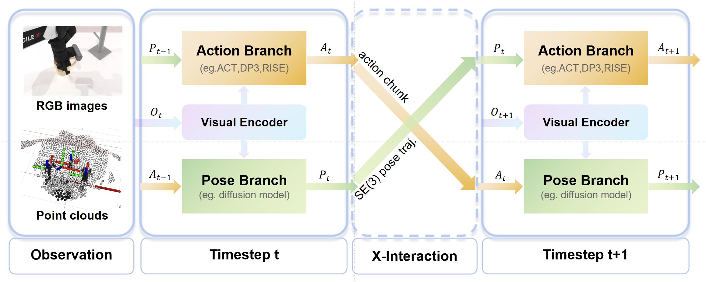

# 🔄 X-Imitator: Spatial-Aware Imitation Learning via Bidirectional Action-Pose Interaction

Authors: [Kai Xiong](https://github.com/Bear-kai), [Hongjie Fang](https://tonyfang.net/), [Lixin Yang](https://github.com/lixiny), [Cewu Lu](https://www.mvig.org/)

This repository contains the code for X-RISE, which performs best in our [[Paper]](http://arxiv.org/abs/2605.12162) as one of the instantiations of X-Imitator.



## 📚 Abstract

Effectively handling the interplay between spatial perception and action generation remains a critical bottleneck in robotic manipulation. Existing methods typically treat these two as decoupled or strictly unidirectional processes, fundamentally restricting a robot’s ability to master complex manipulation tasks. To address this, we propose X-Imitator, a versatile dual-path framework that models spatial perception and action generation through temporally coupled cross-conditioning. Specifically, by conditioning current pose
predictions on past actions and current action predictions on past poses, this framework enables continuous mutual refinement between spatial perception and action generation. This joint modeling exactly mimics human internal forward models. Thanks to its modular architecture, X-Imitator can be flexibly instantiated using various visuomotor policies. Extensive experiments demonstrate that our framework significantly outperforms both vanilla policies and prior methods utilizing explicit pose guidance.

## 🔥 Update

- **[2026/08/25]** Initial release.

## 🛫 Quick Start

### 🖥️ Installation

- For training and evaluation on [RoboTwin 2.0](https://github.com/robotwin-Platform/RoboTwin) benchmark, please follow the [installation guide](https://robotwin-platform.github.io/doc/usage/robotwin-install.html) to install the `robotwin` conda environment. Clone this repository and put it under the `RoboTwin/policy/` directory. Use the files in `third/robotwin` to replace the corresponding files in the cloned robotwin repository (run `replace_files.py` from X-RISE directory). Activate `robotwin` environment and install the necessary dependencies of [RISE]((https://github.com/rise-policy/RISE/blob/main/assets/docs/INSTALL.md)). Refer to [install.md](/docs/install.md) for more details.

### 🛢️ Data Collection

- For simulated tasks, please follow the [guide](https://robotwin-platform.github.io/doc/usage/collect-data.html) to collect data. Here is an example:

  ```bash
  cd path/to/RoboTwin
  bash collect_data.sh beat_block_hammer demo_clean 0
  ```

- For real-world tasks, we provide sample data on [Google Drive](https://drive.google.com/drive/folders/1IvWAklg39QdEixwd5LboVobA9YwoN6fS?usp=sharing) and [Baidu Netdisk](https://pan.baidu.com/s/1OOiQ5RnUqohzD5miwZzAuw) (code: pmdm), which also include the checkpoints for simulated tasks.

### 🚅 Training

- Use the provided checkpoints to skip training. Otherwise, modify the arguments inside the following bash scripts, then run from `policy/X-RISE` directory:

  ```bash
  bash command_train.sh      # for base RISE
  bash command_train_X.sh    # for X-RISE
  ```

### 📊 Evaluation

- For simulated tasks, modify the arguments inside the following bash scripts, then run from `policy/X-RISE` directory:

  ```bash
  bash command_eval.sh     # for base RISE
  bash command_eval_X.sh   # for X-RISE
  ```

- For real-world tasks, we provide evaluation code implemented for a hardware setup comprising a Flexiv Rizon 4 robotic arm, a Dahuan AG-95 gripper, and an Intel RealSense D435 RGB-D camera.

  ```bash
  bash eval_real.py       # for base RISE
  bash eval_real_X.py     # for X-RISE
  ```

## 🙏 Acknowledgement

We thank the authors of [RISE](https://github.com/rise-policy/RISE) and [RoboTwin 2.0](https://github.com/robotwin-Platform/RoboTwin) for their open-source contributions.

## ✍️ Citation

```bibtex
@misc{xiong2026ximitator,
      title={X-Imitator: Spatial-Aware Imitation Learning via Bidirectional Action-Pose Interaction}, 
      author={Kai Xiong and Hongjie Fang and Lixin Yang and Cewu Lu},
      year={2026},
      eprint={2605.12162},
      archivePrefix={arXiv},
      primaryClass={cs.RO},
      url={https://arxiv.org/abs/2605.12162}, 
}
```

## 📃 License

Since RISE is licensed under <a href="https://creativecommons.org/licenses/by-nc-sa/4.0/?ref=chooser-v1" target="_blank" rel="license noopener noreferrer" style="display:inline-block;">CC BY-NC-SA 4.0</a>. We follow the same one for X-RISE.
